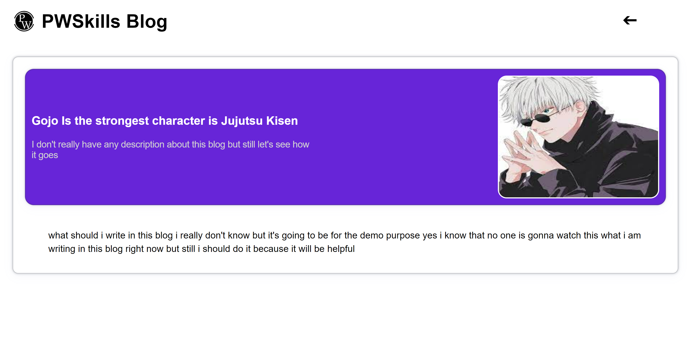

# Blog App

### Create your own blog

#### Home Page

#### Blog Page

### WEBSITE USER FLOW >

    Users can create their own blog and they can view the whole blog also in 
    
    Blogpage, and the blogs will be saved in their local storage.