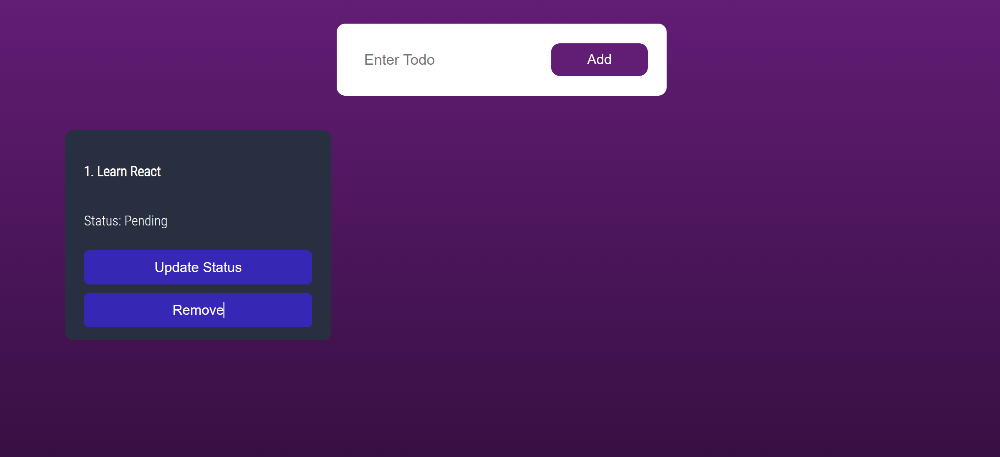

# TODO App

### Create Your Todo

#### Home Page

### WEBSITE USER FLOW >

    User can Add new Todo in List & Can update Status from Panding to Completed.

    And User can Remove the Todo from the List by clicking on Remove button.

*
    The Todos created by user will be stored in db.json file, only start the json-server first - command *** json-server --watch --port 3001 db.json ***

